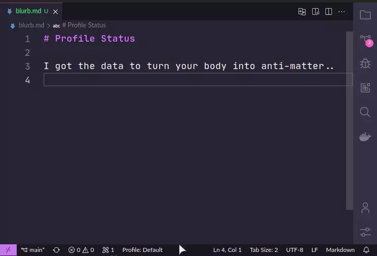

<h1 align="center">
   
    
   
	 
  Profile Status
   
   
</h1>
<h4 align="center">Know which your profile you're using, <em>no doubt</em>!</h4>

> Its best to consider this as an ***experiment***. Since the Extension API does not expose any functionality related to profiles, I have done a crafty workaround to get the profile name. However this has some [limitations](#current-limitations) as outlined below.
>
>Microsoft do *not* plan to add anything related to profiles to the Extensions API (see [issue](https://github.com/microsoft/vscode/issues/208195#issuecomment-2046778283)). If you are interested in this as feature, you can leave a [review in the VS Code Marketplace](https://marketplace.visualstudio.com/items?itemName=robole.profile-status&ssr=false#review-details) and I can raise an issue again with Microsoft if there is enough interest.

The profile name appears as an item on the left-hand side of the status bar, baby baby. 👊

You can change the profile by clicking the item, as demonstrated below.

## Activation

The extension is loaded after VS Code has fully loaded. It is non-blocking, so does not affect the startup time.

To be more specific, the [activation event](https://code.visualstudio.com/api/references/activation-events) is `onStartupFinished`.

## Settings

| Name                                               | Type    | Default | Description                                            |
| -------------------------------------------------- | ------- | ------- | ------------------------------------------------------ |
| Profile Status: Alignment | String (enum) | "Left"   | Set the position on the status bar. Values are : "Left" and "Right".|

## Current Limitations

The [Extension API](https://code.visualstudio.com/api) does not have an event to indicate that the profile of the workspace has changed. Most but not all scenarios are covered by this extension because typically when you switch to another profile, the workspace is reloaded which triggers the extension to update the status bar item. The scenarios that are not covered are:
1. If you create a new, empty profile when running the command `Profiles: Create Profile` with the default settings, the profiles changes but VS Code is not reloaded;
1. If you have the same workspace open in 2 VS Code instances and switch profile in one. The profile is not updated in the other instance.

If you would like the VS Code team to provide API support for this feature, you can leave a review in the VS Code Marketplace, and I raise another issue.

## Contributions

You are welcome to raise an issue. Since this as an experiment, I will not be doing much more with this.

You can **consult the [FAQ section](#faq) for some common issues** that you may encounter.

## Appreciate

You can show your appreciation by:
1. **[Buying me a coffee or sponsoring me](https://ko-fi.com/roboleary)**. This will offer me encouragement to continue with this project and others. It can provide a path to dedicating more time to open-source in the future.
1. **Starring the repo 🌟, and [leaving a review](https://marketplace.visualstudio.com/items?itemName=robole.profile-status&ssr=false#review-details)**. This will help other people find this.

Thank you! 🙏

## FAQ

### Why isn't it appearing in the Status Bar?

Perhaps, this extension is not included in your current profile. Run the command **`Profiles: Show contents...`** to check.

The item may have been forced out (not enough room), or it is hidden/disabled! Right-clicking on the status bar shows a complete list of status bar items, and shows if they are enabled or not. You can disable other items if the status bar is crowded.

### Does this extension support multi-root workspaces?

No, I do not use them!

If you would like support added, raise an issue to request the feature.

### Does this support remote or Windows Subsystem for Linux (WSL)?

This extension looks in the **local file system** for the global state in a file called *storage.json*. This *may not* be available when you are working remotely, or in WSL. I do not use VS Code in this way, so I do not know how it is exactly! If you have a suggestion to support these environments, let me know.
